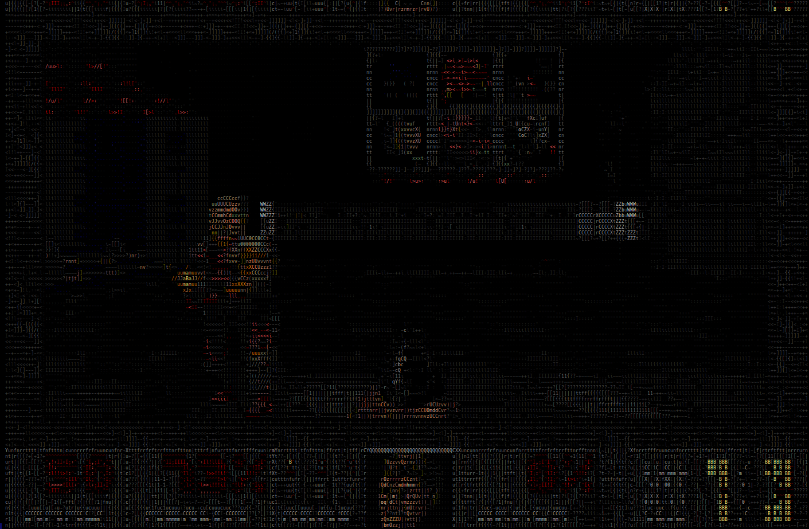

English version [below](#objective). 

---

# Цель

Запустить [Doom](https://en.wikipedia.org/wiki/Doom_(1993_video_game)) на PostgreSQL.

# Попробовать

Для удобства весь процесс реализован в виде Docker образа, который можно попробовать.

Необходимо только вручную подложить файл `doom.wad`, который защищён авторским правом и не является свободно распространяемым.

```bash
git clone https://github.com/DreamNik/pg_doom
cd pg_doom
<вручную поместите Ваш файл doom.wad в директорию pg_doom>
docker build --tag pg_doom --file docker/Dockerfile .
docker run --rm --interactive --tty pg_doom
```



Управление - кнопками A, S, D, W, F, E.

# Архитектура решения

Решение будет состоять из:
- расширения "pg_doom", которое будет работать внутри СУБД;
- bash-скрипта, который будет работать как интерфейс ввода вывода.

Расширение будет предоставлять две новые функции в языке SQL. Первая - будет передавать нажатые клавиши, вторая - получать "картинку" для отображения. А скрипт будет, в свою очередь, считывать нажатые кнопки, передавая их как аргумент первой функции, а после вызывать вторую функцию и отображать её результат.

# Подготовка

Для того, чтобы написать расширение нам потребуются:
- компьютер с ОС Debian;
- установленный PostgreSQL с набором для разработки;
- компилятор языка C и набор утилит GNU Make.

В статье используется ОС Debian, но можно использовать и любую другую ОС семейства Linux с соответствующей адаптацией некоторых шагов. Windows тоже подойдёт, но там шаги подготовки совсем другие.
Итак, открываем консоль и ставим необходимые пакеты:

```bash
export DEBIAN_FRONTEND=noninteractive && \
apt-get update && \
apt-get install -y \
	git \
	build-essentials \
	postgresql
```

# Создание расширения

Исходный код расширения для PostgreSQL будет состоять из:
- файла с метаданными расширения - "pg_doom.control".
- файлов с SQL кодом инициализации расширения в базе - "pg_doom.sql";
- файла сборки расширения - "Makefile";
- файлов с исходным кодом - "pg_doom.c" и другие.

В статье приведён далеко не весь исходный код. Весь исходный код можно посмотреть в репозитории [pg_doom](https://github.com/DreamNik/pg_doom)

## Файл pg_doom.control

Этот файл используется PostgreSQL для определения состава расширения и куда и как его загружать.

```
comment         = 'Provides ability to play the game.'
default_version = '1.0'
relocatable     = false
module_pathname = '$libdir/pg_doom'
schema          = doom
```

Из интересного здесь это module_pathname - путь, указывающий на собранный бинарный модуль.

## Файл pg_doom--1.0.sql

Этот файл выполняется при загрузке расширения в базу данных. При необходимости в таких файлах создают таблицы, представления, триггеры, функции и другие структуры, необходимые для работы расширения. Нам необходимо предоставить в схеме базы данных только две функции - ввода и вывода данных:

```SQL
CREATE PROCEDURE doom.input(
    IN  chars      TEXT,
    IN  duration   INTEGER)
AS 'MODULE_PATHNAME', 'pg_doom_input' LANGUAGE C;

CREATE FUNCTION doom.screen(
    IN  width      INTEGER DEFAULT 320,
    IN  height     INTEGER DEFAULT 200,
    OUT lineNumber INTEGER,
    OUT lineText   TEXT)
RETURNS SETOF RECORD
AS 'MODULE_PATHNAME', 'pg_doom_screen' LANGUAGE C;
```

В файле используется ключевое значение `MODULE_PATHNAME` в качестве имени модуля функции. Это значение подменяется на фактический адрес загружаемого модуля (библиотеки), которое указано в control файле.

## Файл Makefile

Файл используется для компиляции и установки расширения. В начале файла задаются имя и описание расширения:
```Makefile
MODULE_big = pg_doom
EXTENSION  = pg_doom
PGFILEDESC = pg_doom
```

Далее задаётся список файлов данных, которые будут установлены вместе с расширением
```Makefile
DATA = pg_doom--1.0.sql pg_doom.control
```

Далее, задаём список объектных файлов, которые необходимо собрать. То есть, задаётся не список исходных файлов, а список артефактов сборки. Из перечисленных объектных файлов и будет собрана библиотека.
```Makefile
OBJS = pg_doom.c ...
```

Вызов компилятора и скрипты сборки установлены в системе и могут быть подключены при помощи механизма [PGXS](https://www.postgresql.org/docs/current/extend-pgxs.html). Для получения путей в системе присутствует утилита [pg_config](https://www.postgresql.org/docs/current/app-pgconfig.html).

```Makefile
PG_CONFIG = pg_config
PGXS     := $(shell $(PG_CONFIG) --pgxs)
bindir   := $(shell $(PG_CONFIG) --bindir)
include $(PGXS)
```

## Файлы C

В файлах размещается исходный код функций, которые мы объявили в sql файле.

В общем случае, чтобы собранная библиотека загрузилась как расширение необходимо:
- вызвать макрос `PG_MODULE_MAGIC`;
- для каждой экспортируемой функции вызвать макрос `PG_FUNCTION_INFO_V1(my_function_name)`;
- все экспортируемые функции должны иметь сигнатуру `Datum my_function_name( FunctionCallInfo fcinfo )`;
- определить две функции - `void _PG_init(void)` и `void _PG_fini(void)`.

Подробное описание функций и их состав можно посмотреть в репозитории с исходным кодом расширения.

## Интеграция игры

Для сборки ядра игры необходим пропатченный исходный код, в котором исправлены некоторые конструкции языка, которые мешали оригинальному коду компилироваться и запускаться под современными 64-битными системами. Оригинальный исходный код ядра игры можно найти [тут](https://github.com/id-Software/DOOM).

Для запуска игры нужен файл doom.wad. Он содержит все медиаданные игры, но, к сожалению, не является свободно распространяемым в отличие от ядра игры. Его можете взять из директории оригинальной игры или получить любым другим легальным способом.

Для интеграции игры реализована в файле `doom.c`. При первом вызове создаётся отдельный поток, в котором вызывается функция `D_DoomMain`, которая представляет собой основной цикл игры.

В процессе работы цикла игры вызываются функции, которые управляют вводом-выводом игры:
- I_InitGraphics;
- I_ShutdownGraphics;
- I_SetPalette;
- I_StartTic;
- I_ReadScreen;
- I_InitNetwork.

При обычном запуске игры эти функции реализованы в драйверах ввода-вывода игры. Но в нашем расширении драйвера мы не компилируем, а функции определены на взаимодействие со структурами, которые доступны из объявленных функций `pg_doom_input` и `pg_doom_screen`.


# Компиляция

Запускаем сборку и установку в систему при помощи типовых вызовов make:
```bash
make -j$(nproc) && sudo make install
```

# Запуск сервера

Если в системе не запущен PostgreSQL, то можно создать временный экземпляр и запустить его:
```bash
export PGDATA=/tmp/pg_doom_data
mkdir -p $PGDATA

initdb --no-clean --no-sync

cat >> $PGDATA/postgresql.conf <<-EOF
    log_filename             = 'server.log'
    log_min_messages         = 'warning'
    shared_preload_libraries = ''
    listen_addresses         = '0.0.0.0'
EOF

cat >> $PGDATA/pg_hba.conf <<-EOF
    host all    postgres 127.0.0.1/32 trust
    host doomdb slayer   0.0.0.0/0    trust
EOF

pg_ctl start &> /dev/null
```

# Загрузка расширения

Для запуска игры создаём и настраиваем базу данных:
```SQL
CREATE DATABASE doomdb;
CREATE EXTENSION IF NOT EXISTS pg_doom;
CREATE ROLE slayer WITH LOGIN;
GRANT USAGE ON SCHEMA doom TO slayer;
GRANT EXECUTE ON ALL FUNCTIONS IN SCHEMA doom TO slayer;
```

# Запуск игры

Для "комфортной" игры нам необходим скрипт-обёртка. Он должен заниматься вводом-выводом, аналогичным как при обычной игре. Для этого нам нужно считывать нажатые кнопки и отображать картинку на экране. Перед запуском необходимо подготовить терминал:
```bash
stty -echo
clear
cols=$(expr $(tput cols  || 281) - 1)
rows=$(expr $(tput lines ||  92) - 2)
```

И далее запустить цикл:
```bash
{
    while true; do
        while read -n 1 -s -t 0.02 k; do
            echo "CALL doom.input('$k',10);";
        done;
        echo "SELECT '\\x1B[H';";
        echo "SELECT linetext FROM doom.screen($cols,$rows);";
        sleep 0.2;
    done;
} | psql -h 127.0.0.1 -U slayer -d doomdb -P pager=off -t -q | sed 's|\\x1B|\x1B|g'
```

В цикле мы динамически формируем текстовые SQL команды и отправляем их в stdin утилиты psql, которая подключается к базе данных. Её вывод затем форматируется и выводится на экран. Скорость обновления и input-lag сильно зависит от возможностей компьютера и игрока.

---

# Objective 

Run [Doom](https://en.wikipedia.org/wiki/Doom_(1993_video_game)) on PostgreSQL.

# Try it out

For convenience, the whole process is implemented as a Docker image, which you can try.

You only need to manually place the `doom.wad` file, which is copyright protected and not freely distributable.

```bash
git clone https://github.com/DreamNik/pg_doom
cd pg_doom
<manually place your doom.wad file in the pg_doom directory>
docker build --tag pg_doom --file docker/Dockerfile .
docker run --rm --interactive --tty pg_doom
```


Controls - using the A, S, D, W, F, E keys.

# Solution Architecture

The solution will consist of:
- the "pg_doom" extension, which will work inside the DBMS;
- a bash script, which will act as an input-output interface.

The extension will provide two new functions in the SQL language. The first will transmit the pressed keys; the second will get the "picture" for display. The script will, in turn, read the pressed buttons, passing them as an argument to the first function, and then call the second function and display its result.

# Preparation

To write the extension, we will need:
- a computer with Debian OS;
- installed PostgreSQL with a development set;
- a C language compiler and a set of GNU Make utilities.

The article uses Debian OS, but you can use any other Linux family OS with appropriate adaptation of some steps. Windows will also work, but the preparation steps are entirely different.
So, we open the console and install the necessary packages:

```bash
export DEBIAN_FRONTEND=noninteractive && \
apt-get update && \
apt-get install -y \
	git \
	build-essentials \
	postgresql
```

# Creating the Extension

The source code for the PostgreSQL extension will consist of:
- an extension metadata file - "pg_doom.control";
- files with SQL code for initializing the extension in the database - "pg_doom.sql";
- an extension build file - "Makefile";
- source code files - "pg_doom.c" and others.

The article does not provide all the source code. You can view the full source code in the [pg_doom](https://github.com/DreamNik/pg_doom) repository.

## pg_doom.control File

This file is used by PostgreSQL to define the composition of the extension and how and where to load it.

```
comment         = 'Provides ability to play the game.'
default_version = '1.0'
relocatable     = false
module_pathname = '$libdir/pg_doom'
schema          = doom
```

The interesting part here is the module_pathname - the path indicating the compiled binary module.

## pg_doom--1.0.sql File

This file is executed when loading the extension into the database. If necessary, such files create tables, views, triggers, functions, and other structures required for the extension to work. We only need to provide two functions in the database schema - for input and output:

```SQL
CREATE PROCEDURE doom.input(
    IN  chars      TEXT,
    IN  duration   INTEGER)
AS 'MODULE_PATHNAME', 'pg_doom_input' LANGUAGE C;

CREATE FUNCTION doom.screen(
    IN  width      INTEGER DEFAULT 320,
    IN  height     INTEGER DEFAULT 200,
    OUT lineNumber INTEGER,
    OUT lineText   TEXT)
RETURNS SETOF RECORD
AS 'MODULE_PATHNAME', 'pg_doom_screen' LANGUAGE C;
```

The key value `MODULE_PATHNAME` is used in the file as the module's name for the functions. This value is replaced with the actual address of the loaded module (library), as specified in the control file.

## Makefile

The file is used for compiling and installing the extension. At the beginning of the file, the name and description of the extension are defined:

```Makefile
MODULE_big = pg_doom
EXTENSION  = pg_doom
PGFILEDESC = pg_doom
```

Next, the list of data files that will be installed with the extension is defined:

```Makefile
DATA = pg_doom--1.0.sql pg_doom.control
```

Then, we define the list of object files that need to be compiled. That is, we're defining not the list of source files, but the list of build artifacts. The library will be assembled from the listed object files.

```Makefile
OBJS = pg_doom.c ...
```

The compiler call and build scripts are installed in the system and can be included using the [PGXS](https://www.postgresql.org/docs/current/extend-pgxs.html) mechanism. The utility [pg_config](https://www.postgresql.org/docs/current/app-pgconfig.html) is present in the system for obtaining paths.

```Makefile
PG_CONFIG = pg_config
PGXS     := $(shell $(PG_CONFIG) --pgxs)
bindir   := $(shell $(PG_CONFIG) --bindir)
include $(PGXS)
```

## C Files

In these files, the source code of the functions we declared in the SQL file is located.

Generally, in order for the compiled library to be loaded as an extension, you need to:
- call the macro `PG_MODULE_MAGIC`;
- for each exported function, call the macro `PG_FUNCTION_INFO_V1(my_function_name)`;
- all exported functions must have the signature `Datum my_function_name( FunctionCallInfo fcinfo )`;
- define two functions - `void _PG_init(void)` and `void _PG_fini(void)`.

A detailed description of the functions and their composition can be found in the repository with the source code of the extension.

## Game Integration

To build the game's core, a patched source code is required, in which some language constructs that interfered with the original code's compilation and execution on modern 64-bit systems have been fixed. The original source code of the game's core can be found [here](https://github.com/id-Software/DOOM).

To run the game, you need the file doom.wad. It contains all the game's media data, but unfortunately, unlike the game's core, it is not freely distributed. You can take it from the directory of the original game or obtain it by any other legal means.

Game integration is implemented in the `doom.c` file. The first call creates a separate thread in which the function `D_DoomMain` is called, which represents the main loop of the game.

During the game loop's operation, functions are called that control the game's input-output:
- I_InitGraphics;
- I_ShutdownGraphics;
- I_SetPalette;
- I_StartTic;
- I_ReadScreen;
- I_InitNetwork.

In a typical game run, these functions are implemented in the game's I/O drivers. But in our extension, we don't compile the drivers, and the functions are defined to interact with the structures available from the declared functions `pg_doom_input` and `pg_doom_screen`.

# Compilation

We initiate the build and installation into the system using standard make calls:
```bash
make -j$(nproc) && sudo make install
```

# Starting the Server

If PostgreSQL is not running on your system, you can create a temporary instance and start it:
```bash
export PGDATA=/tmp/pg_doom_data
mkdir -p $PGDATA

initdb --no-clean --no-sync

cat >> $PGDATA/postgresql.conf <<-EOF
    log_filename             = 'server.log'
    log_min_messages         = 'warning'
    shared_preload_libraries = ''
    listen_addresses         = '0.0.0.0'
EOF

cat >> $PGDATA/pg_hba.conf <<-EOF
    host all    postgres 127.0.0.1/32 trust
    host doomdb slayer   0.0.0.0/0    trust
EOF

pg_ctl start &> /dev/null
```

# Loading the Extension

To start the game, create and configure the database:
```SQL
CREATE DATABASE doomdb;
CREATE EXTENSION IF NOT EXISTS pg_doom;
CREATE ROLE slayer WITH LOGIN;
GRANT USAGE ON SCHEMA doom TO slayer;
GRANT EXECUTE ON ALL FUNCTIONS IN SCHEMA doom TO slayer;
```

# Starting the Game

For a "comfortable" game, we need a wrapper script. It should handle input-output, similar to a regular game. For this, we need to read the pressed buttons and display the picture on the screen. Before starting, prepare the terminal:
```bash
stty -echo
clear
cols=$(expr $(tput cols  || 281) - 1)
rows=$(expr $(tput lines ||  92) - 2)
```

And then run the loop:
```bash
{
    while true; do
        while read -n 1 -s -t 0.02 k; do
            echo "CALL doom.input('$k',10);";
        done;
        echo "SELECT '\\x1B[H';";
        echo "SELECT linetext FROM doom.screen($cols,$rows);";
        sleep 0.2;
    done;
} | psql -h 127.0.0.1 -U slayer -d doomdb -P pager=off -t -q | sed 's|\\x1B|\x1B|g'
```

In the loop, we dynamically form textual SQL commands and send them to stdin of the psql utility, which connects to the database. Its output is then formatted and displayed on the screen. The refresh rate and input lag depend heavily on the computer's and player's capabilities.